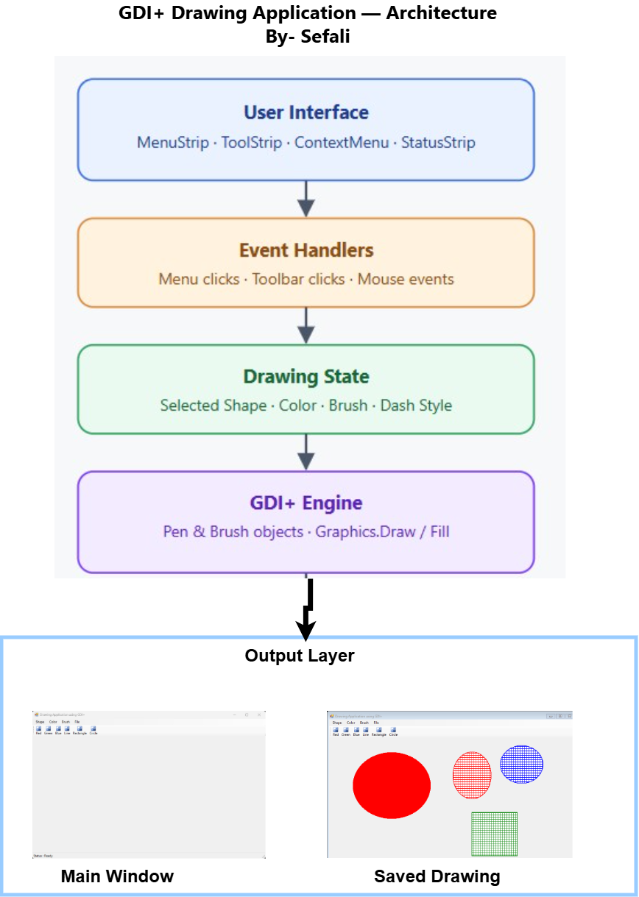
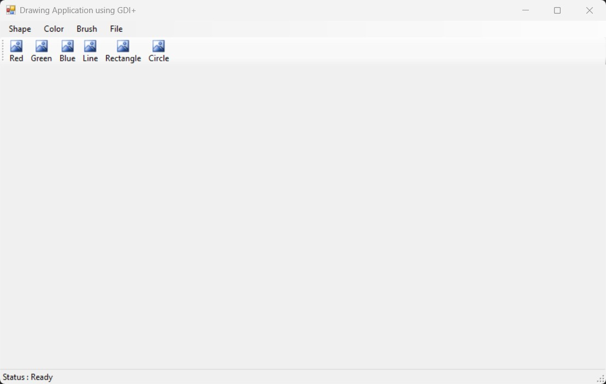
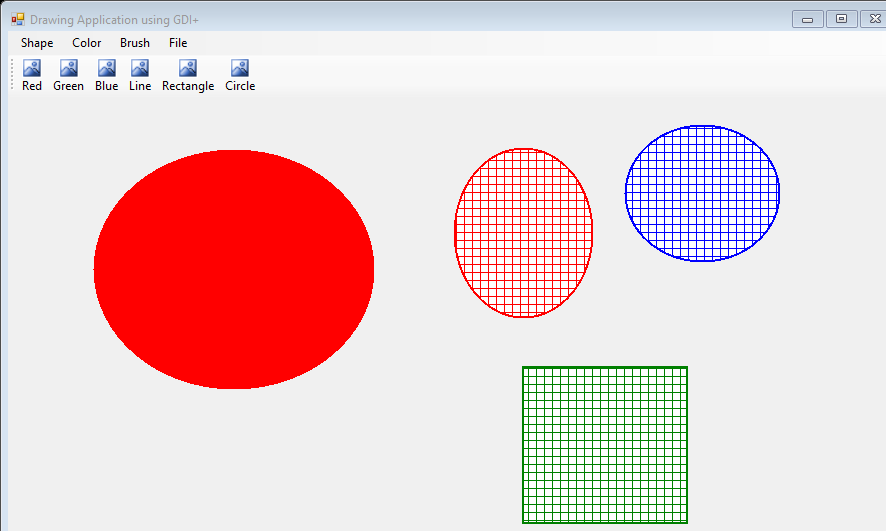

#  Drawing Application using GDI+ (C# Windows Forms)

A Windows Forms Drawing Application developed using **C#** and **GDI+ Graphics**.

This project demonstrates object-oriented programming, event-driven programming, GDI+ drawing techniques, custom brushes, context menus, file handling, and Windows Forms controls.

---

##  Features

- Draw Line
- Draw Rectangle
- Draw Circle
- Solid Brush
- Hatch Brush
- Linear Gradient Brush
- Texture Brush
- Path Gradient Brush
- Red, Green, Blue Colors
- Solid, Dash, Dot, DashDot Pen Styles
- Context Menu
- Toolbar Buttons
- Status Strip
- Save Drawing as PNG Image
- Clear Canvas

---

##  Technologies Used

- C#
- Windows Forms
- .NET Framework
- GDI+
- Visual Studio 2026

##  Project Structure

```text
DrawingApp/
│
├── App.config
├── Form1.cs
├── Form1.Designer.cs
├── Form1.resx
├── Program.cs
├── Properties/
│   ├── AssemblyInfo.cs
│   ├── Resources.resx
│   └── Settings.settings
├── Screenshots/
│   ├── main-window.jpg
│   ├── drawing.png
│   
└── README.md
```
---

# Architecture Diagram

The following diagram illustrates the overall architecture and workflow of the Drawing Application.



---
##  How to Run

1. Clone the repository

```bash
git clone https://github.com/YOUR_USERNAME/CSharp-Drawing-Application.git
```

2. Open the solution in Visual Studio.

3. Press

```
F5
```

or

```
Start
```

The Drawing Application will launch.

---

##  Application Features

### Shapes

- Line
- Rectangle
- Circle

### Colors

- Red
- Green
- Blue

### Brushes

- Solid Brush
- Hatch Brush
- Linear Gradient Brush
- Texture Brush
- Path Gradient Brush

### Pen Styles

- Solid
- Dash
- Dot
- DashDot

### File Menu

- Save Image
- Clear Canvas
- Exit

### Other Features

- Mouse-based drawing
- Double Buffered rendering
- Context Menu
- ToolStrip
- StatusStrip

##  Screenshots

###  Main Application Window

The main interface of the Drawing Application showing the menu bar, toolbar, drawing canvas, and status bar.



---

###  Saved Drawing (PNG Output)

This image was created using the application's **File → Save Image** feature and demonstrates the exported drawing in PNG format.


##  Learning Outcomes

This project demonstrates:

- Windows Forms Development
- GDI+ Graphics Programming
- Event Handling
- Object-Oriented Programming
- Graphics Rendering
- Brushes and Pens
- File Saving
- Context Menus
- Toolbars
- StatusStrip
- Mouse Events

---

##  Author

**sefali sabnam**

